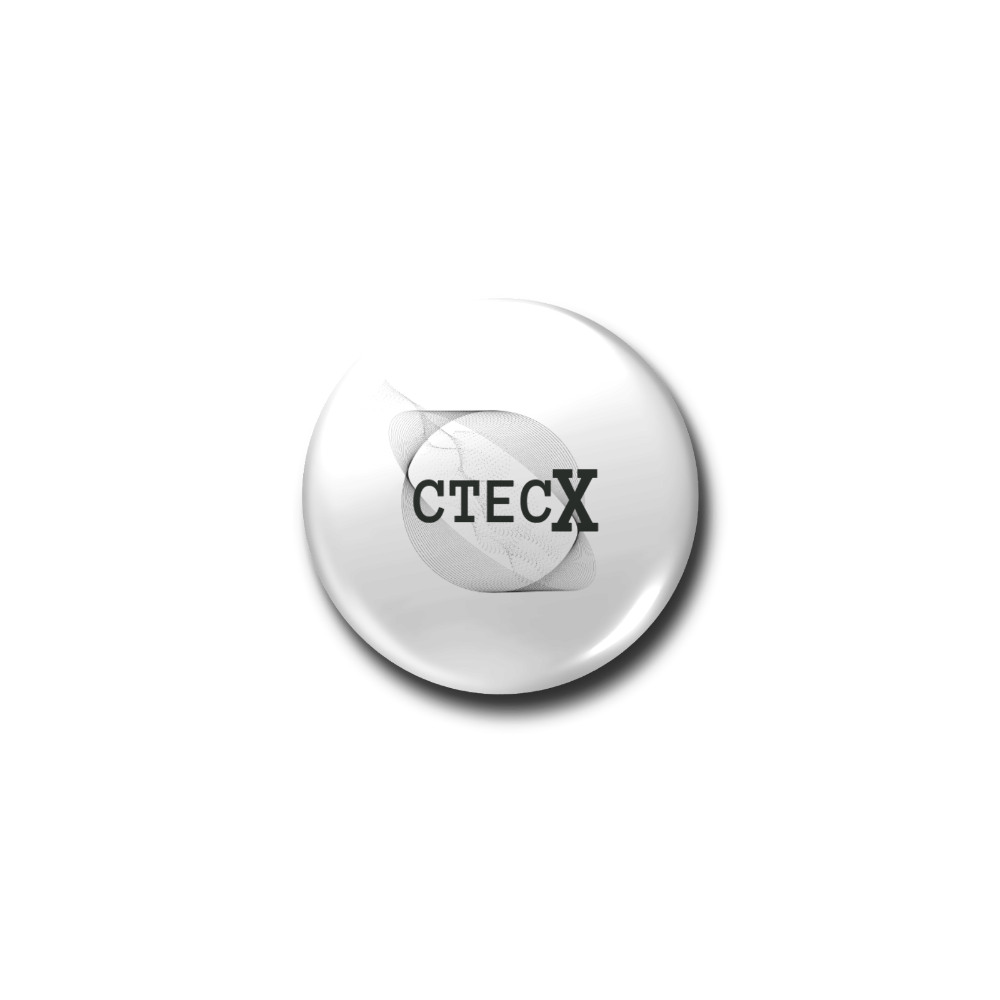

# CTECX

<p align="center">
  
</p>

**AI Coordination Infrastructure**

CTECX is the development and coordination layer for agentic AI ecosystems. It focuses on building practical tools and infrastructure that enable reliable human-AI collaboration across cloud, local, and enterprise environments.

This repository currently hosts the CTECX corporate website and related coordination interfaces.

## CTECX Developer Toolkit

The **CTECX Developer Toolkit** is the unified reference implementation for
building developer tooling on the CTECX platform: **IDE** components, an
**ADE (Agentic Development Environment)** harness, and a **scripting/language
workbench** that runs from **assembly** up through a custom language runtime.

Owning identity: **wan mohd azizi bin wan hosen, ctaxnagomi, est 2024**.

### What is included

- **Research pack** — grounded notes on x86-64 assembly & machine code, language
  design (lexer → parser → AST → bytecode VM), the Tree-sitter + LSP hybrid IDE
  architecture vs the ADE agent loop, and the Electron vs Tauri (2.0) shell choice.
- **`ctecx-tk` CLI** (Python 3.9+, stdlib-only)
  - `ctecx-tk init-ide <name>` — scaffold an IDE (incremental parser + LSP stub)
  - `ctecx-tk init-ade <name>` — scaffold an agentic dev environment harness
  - `ctecx-tk init-language <name>` — scaffold a language workbench with a working bytecode VM
  - `ctecx-tk instruct INSTRUCT.md` — pack a task log into the `ctecx_instruct`
    format (five parts: `.md` `.sh` `.sql` `.json` `.assembly`, zipped)
- **Samples** — `hello_x64.asm` (syscall-only x86-64), a Rust tokenizer, a
  minimal Electron main, a Tauri 2.0 shell config, and an ADE agent harness.

### Quick start

```bash
pip install -e ./ctecx-developerToolKit/python
ctecx-tk init-language ctecx-lang
ctecx-tk instruct --task-id ctecx-example-001 your-task-log.md
```

Follow-up delivery: the **CTECX ADE + IDE** is now built on this toolkit — one
shared "CTECX script" engine (`.ctk`) driving an interactive **IDE** (incremental
syntax, diagnostics, hover, completion, JSON-lines language server) and an
**ADE** (observe → act → verify agent harness with a tool allowlist, a human
gate for destructive steps, and `agent_memory` SQLite persistence). Every task is
logged with the `ctecx_instruct` pack format.

## Related Project: OpenDGUI (DeckerGUI Prototype)

OpenDGUI is the portable prototype of the DeckerGUI vision. It delivers a fully offline, local-first AI workspace that can be carried on a USB pendrive (16 GB minimum, 32 GB recommended).

### Prototype Variations

**Variation 1 – Host OS TUI (Portable)**  
Runs on the host operating system (Windows / Linux / macOS).  
User inserts the USB, launches the provided start script, and a Textual-based TUI appears with the banner “OpenDGUI Connected”.  
Uses llamafile (or equivalent single-file local LLM) for inference. No reboot required.

**Variation 2 – Bootable Own OS**  
The USB contains a minimal Linux environment.  
User restarts the machine, enters the BIOS/UEFI boot menu (commonly F12), selects the USB, and boots directly into the OpenDGUI environment.  
The TUI auto-launches on boot with the same “OpenDGUI Connected” banner.  
Supports persistence so logs, configurations, and models survive reboots.

Both variations share the same core features:
- Local LLM inference (quantized models such as Phi-3 Mini)
- Governed AI personas
- AI Gratitude System (AGS) prompt wrappers
- Basic token-to-workhour tracking and KPI logging
- Fully offline operation

## Tech Stack (This Repository)

- React 19 + TypeScript
- Vite
- Cloudflare Workers / Pages (via Wrangler)
- Google Generative AI SDK

## Development

```bash
npm install
npm run dev
